# IMSOP - API Flows & Sequences

## Authentication Flow

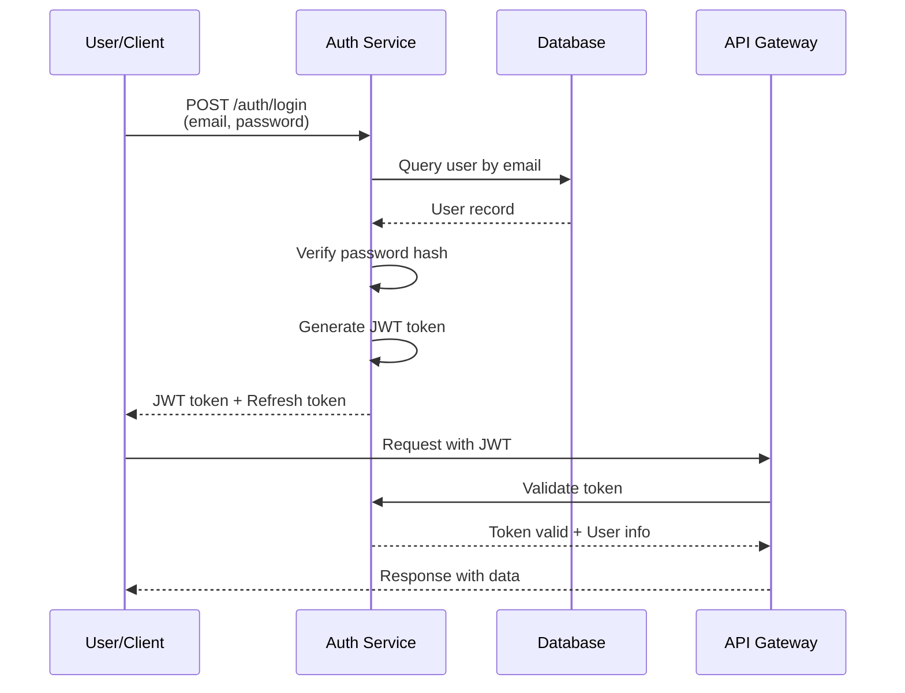

## Supply Chain Order Flow

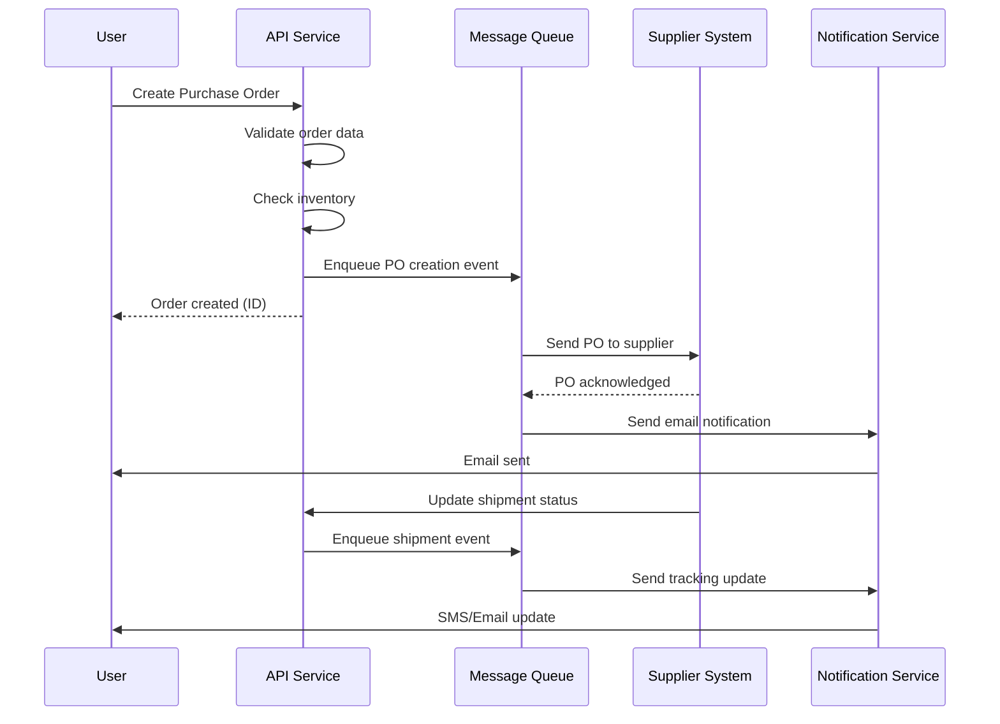

## Real-time Analytics Flow

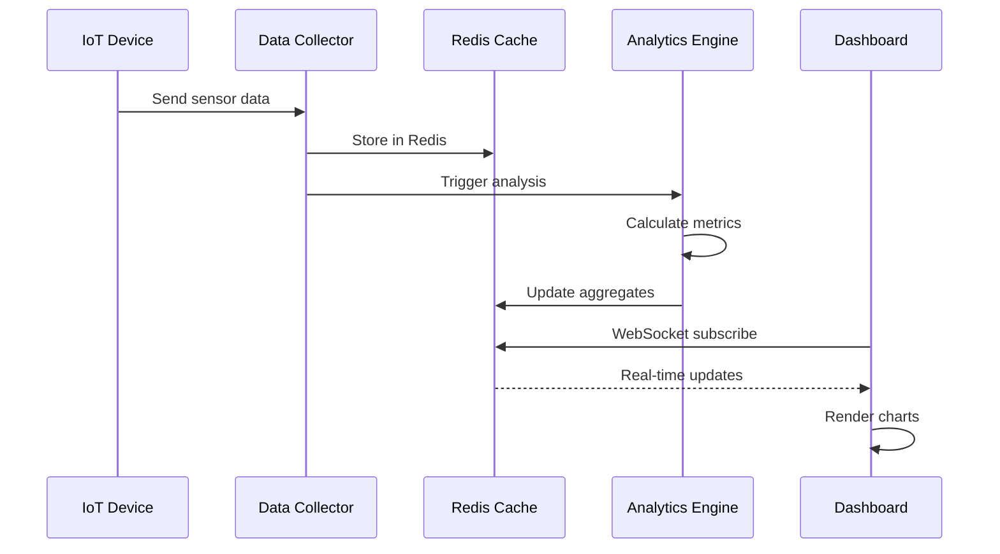

## Multi-Cloud Integration Flow

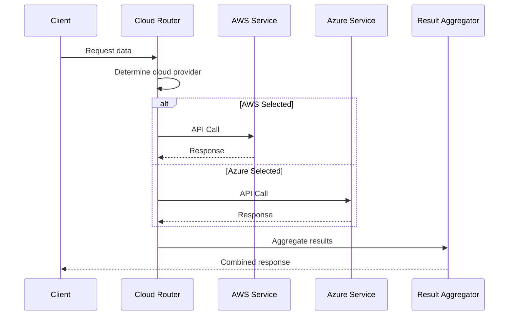

## Inventory Management Flow

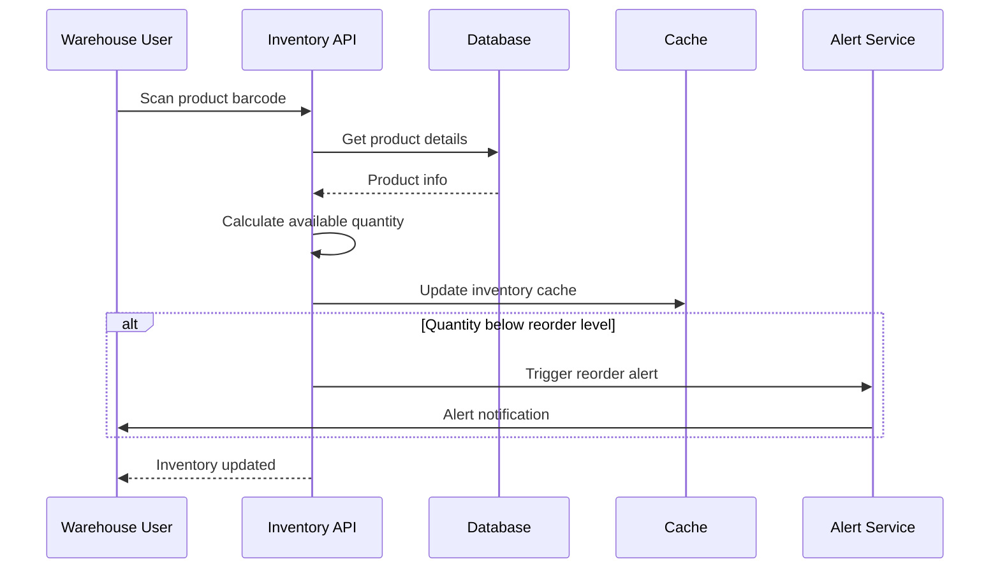

## Shipment Tracking Flow

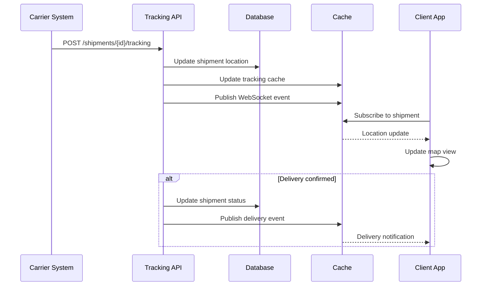

## User Permission Flow

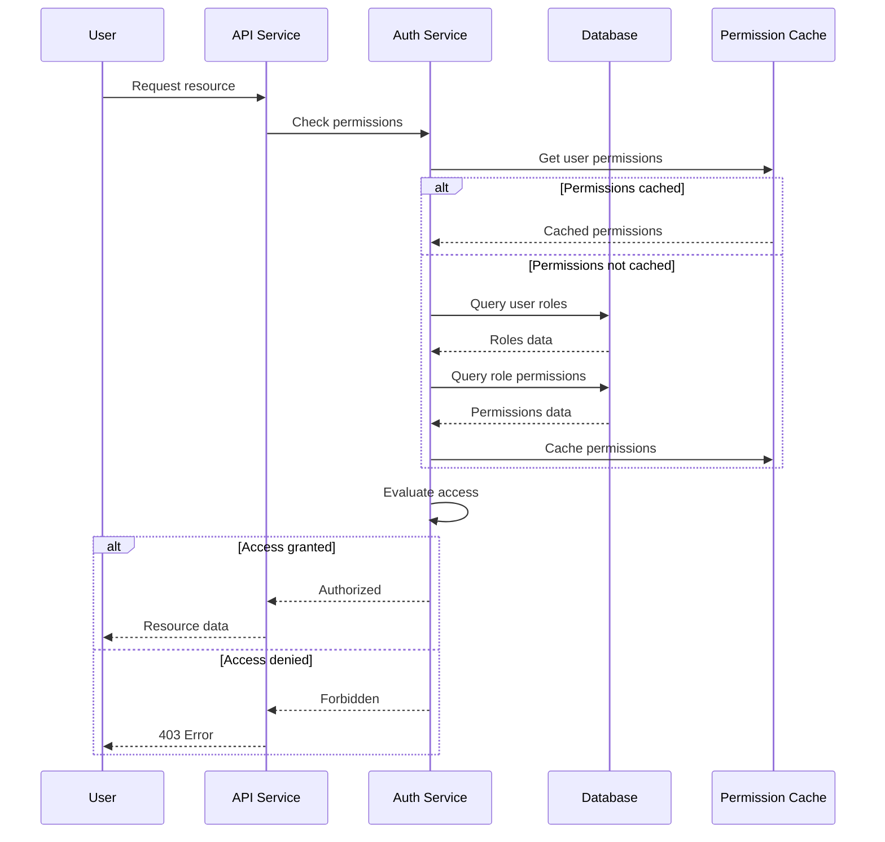

## Report Generation Flow

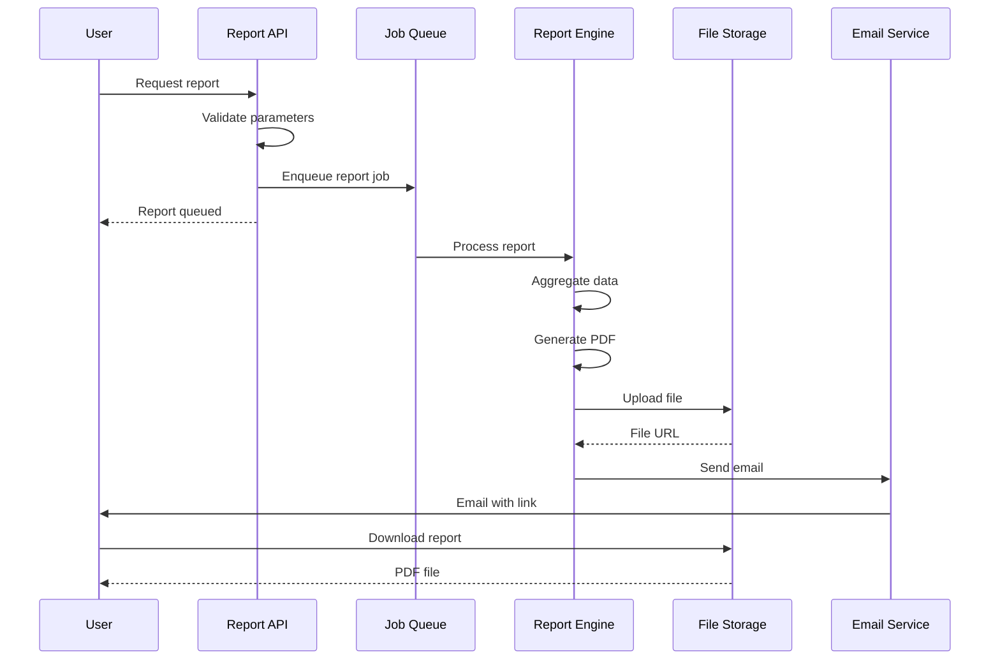

## API Response Formats

### Success Response
```json
{
  "success": true,
  "data": {
    "id": "uuid",
    "name": "Example",
    "createdAt": "2024-01-10T10:00:00Z"
  },
  "meta": {
    "timestamp": "2024-01-10T10:00:00Z",
    "version": "1.0"
  }
}
```

### Error Response
```json
{
  "success": false,
  "error": {
    "code": "VALIDATION_ERROR",
    "message": "Invalid input parameters",
    "details": [
      {
        "field": "email",
        "message": "Invalid email format"
      }
    ]
  },
  "meta": {
    "timestamp": "2024-01-10T10:00:00Z",
    "requestId": "req-12345"
  }
}
```

### Paginated Response
```json
{
  "success": true,
  "data": [
    { "id": "1", "name": "Item 1" },
    { "id": "2", "name": "Item 2" }
  ],
  "pagination": {
    "page": 1,
    "pageSize": 20,
    "total": 100,
    "totalPages": 5,
    "hasNextPage": true,
    "hasPreviousPage": false
  }
}
```

## Rate Limiting Configuration

| Endpoint Type | Requests/Minute | Burst |
|---------------|-----------------|-------|
| Authentication | 5 | 10 |
| Read Operations | 60 | 100 |
| Write Operations | 30 | 50 |
| Bulk Operations | 10 | 20 |
| Search | 30 | 50 |

## Timeout Configuration

| Operation | Timeout |
|-----------|---------|
| API Request | 30s |
| Database Query | 10s |
| File Upload | 5m |
| Report Generation | 10m |
| WebSocket Connection | 30s (idle) |

## API Versioning Strategy

### URL-based Versioning
```
/api/v1/orders
/api/v2/orders
```

### Header-based Versioning
```
Accept: application/vnd.imsop.v1+json
```

### Deprecation Policy
- Announce deprecation 6 months in advance
- Maintain deprecated version for 12 months
- Provide migration guide
- Support both versions during transition

## Error Handling Flow

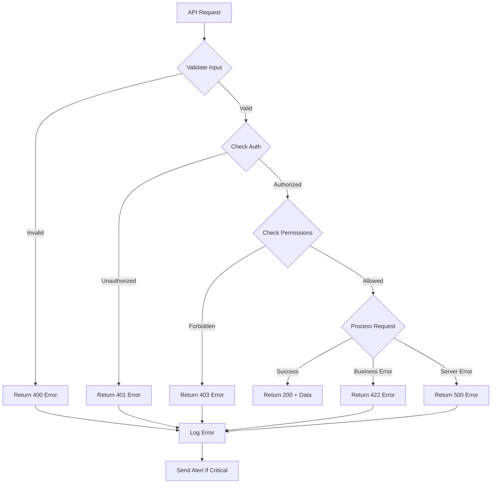

## WebSocket Connection Management

### Connection Flow
```
1. Client initiates WebSocket connection
2. Server validates JWT token
3. Server subscribes client to channels
4. Server sends initial state
5. Client receives real-time updates
6. Connection maintained with heartbeat
7. Client disconnects or timeout
```

### Message Format
```json
{
  "type": "update",
  "channel": "shipments:123",
  "event": "status_changed",
  "data": {
    "shipmentId": "123",
    "status": "in_transit",
    "location": "New York, NY"
  },
  "timestamp": "2024-01-10T10:00:00Z"
}
```

## Data Aggregation Flow

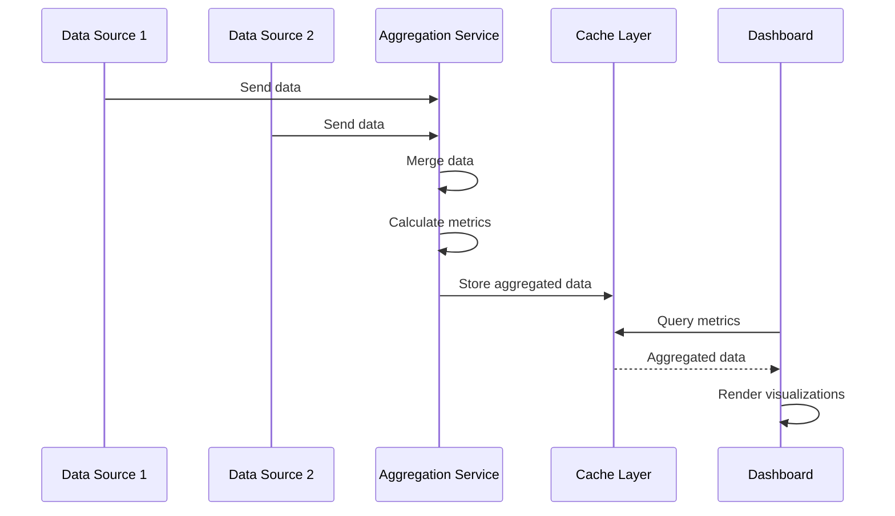

## Multi-Device Grouping Flow

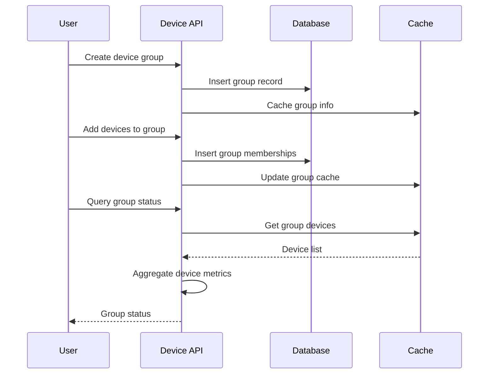

## Performance Optimization Strategies

### Caching Strategy
- Cache frequently accessed data (5 min TTL)
- Cache user permissions (10 min TTL)
- Cache product catalog (1 hour TTL)
- Cache organization settings (1 day TTL)

### Query Optimization
- Use database indexes for common queries
- Implement query result pagination
- Use projection to select only needed fields
- Batch related queries together

### Async Processing
- Queue long-running operations
- Process reports asynchronously
- Send notifications asynchronously
- Archive data asynchronously

### Load Distribution
- Distribute requests across multiple servers
- Use message queues for async tasks
- Cache responses at CDN level
- Implement request batching
