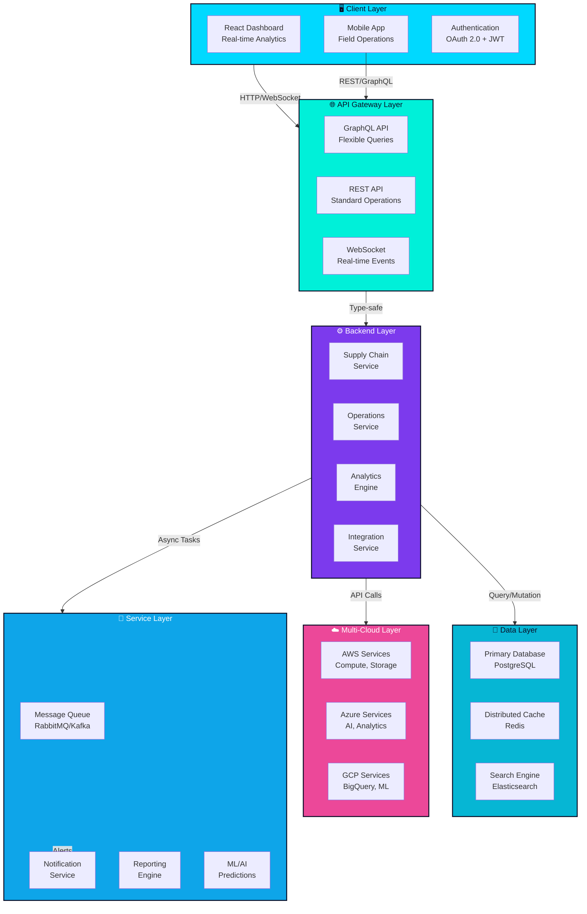

# IMSOP - System Architecture

## Overview

IMSOP (Intelligent Multi-Cloud Supply Chain & Operations Platform) is an enterprise-grade supply chain management and operations platform. It provides comprehensive visibility, control, and optimization across multi-cloud environments and supply chain networks.

## System Architecture Diagram



## Component Details

### Client Layer
- **React Dashboard**: Comprehensive supply chain analytics and management
- **Mobile App**: Field operations and real-time updates
- **Authentication**: OAuth 2.0 with JWT tokens

### API Gateway Layer
- **GraphQL API**: Flexible query language for complex data requirements
- **REST API**: Standard CRUD operations and integrations
- **WebSocket**: Real-time event streaming and notifications

### Backend Layer
- **Supply Chain Service**: Procurement, inventory, logistics management
- **Operations Service**: Workflow automation, task management
- **Analytics Engine**: Predictive analytics and business intelligence
- **Integration Service**: Third-party API integrations and data sync

### Data Layer
- **PostgreSQL Database**: Primary data storage with ACID compliance
- **Redis Cache**: High-performance caching layer
- **Elasticsearch**: Full-text search and log aggregation

### Multi-Cloud Layer
- **AWS Services**: EC2, S3, Lambda, RDS
- **Azure Services**: Cognitive Services, Machine Learning
- **GCP Services**: BigQuery, Dataflow, AI Platform

### Service Layer
- **Message Queue**: Asynchronous task processing
- **Notification Service**: Email, SMS, push notifications
- **Reporting Engine**: PDF generation, scheduled reports
- **ML/AI**: Demand forecasting, anomaly detection

## Data Flow

### Supply Chain Order Flow
```
Order Creation → Validation → Inventory Check
              ↓
         Queue Processing
              ↓
    Supplier Notification → Fulfillment
              ↓
         Shipment Tracking
              ↓
    Delivery & Analytics Update
```

### Real-time Analytics Flow
```
Data Sources → Collection → Processing
                           ↓
                    Cache Update
                           ↓
                    Dashboard Update
                           ↓
                    Alert Generation
```

### Multi-Cloud Integration Flow
```
Local Request → Cloud Router → Cloud Selection
                              ↓
                         Cloud API Call
                              ↓
                         Result Aggregation
                              ↓
                         Response to Client
```

## Technology Stack

| Layer | Technology | Purpose |
|-------|-----------|---------|
| Frontend | React 19 + TypeScript | UI Framework |
| Frontend | GraphQL Client | Data fetching |
| Frontend | Tailwind CSS | Styling |
| Backend | Node.js | Runtime |
| Backend | Express.js | Web Framework |
| Backend | GraphQL | API Layer |
| Database | PostgreSQL | Primary DB |
| Cache | Redis | Performance |
| Search | Elasticsearch | Full-text search |
| Cloud | AWS/Azure/GCP | Infrastructure |
| Queue | RabbitMQ/Kafka | Message Queue |
| Auth | OAuth 2.0 + JWT | Authentication |

## Key Features

### 1. Supply Chain Management
- Procurement automation
- Inventory optimization
- Supplier management
- Purchase order tracking

### 2. Operations Management
- Workflow automation
- Task management
- Resource allocation
- Performance tracking

### 3. Analytics & Insights
- Real-time dashboards
- Predictive analytics
- Anomaly detection
- Custom reports

### 4. Multi-Cloud Support
- AWS integration
- Azure integration
- GCP integration
- Hybrid cloud management

### 5. Integration Capabilities
- ERP system integration
- Third-party API support
- Data synchronization
- Webhook support

## Security Architecture

### Authentication
- OAuth 2.0 for third-party integrations
- JWT for API authentication
- Multi-factor authentication support
- Session management

### Authorization
- Role-based access control (RBAC)
- Attribute-based access control (ABAC)
- Resource-level permissions
- Audit logging

### Data Protection
- End-to-end encryption
- Database encryption at rest
- TLS/SSL in transit
- Data anonymization

## Scalability Considerations

### Horizontal Scaling
- Stateless microservices
- Load balancing
- Database replication
- Cache distribution

### Performance Optimization
- Query optimization
- Caching strategies
- Batch processing
- Asynchronous operations

### Monitoring & Observability
- Centralized logging
- Application performance monitoring
- Error tracking
- Health checks

## Deployment Architecture

```
┌─────────────────────────────────────┐
│     Production Environment          │
├─────────────────────────────────────┤
│  Load Balancer (Multi-region)       │
│         ↓                           │
│  ┌─────────────────────────────┐   │
│  │  Kubernetes Cluster         │   │
│  │  - API Services             │   │
│  │  - Worker Nodes             │   │
│  │  - Service Mesh (Istio)     │   │
│  └─────────────────────────────┘   │
│         ↓                           │
│  ┌─────────────────────────────┐   │
│  │  Data Layer                 │   │
│  │  - PostgreSQL (Primary)     │   │
│  │  - PostgreSQL (Replica)     │   │
│  │  - Redis Cluster            │   │
│  │  - Elasticsearch Cluster    │   │
│  └─────────────────────────────┘   │
│         ↓                           │
│  ┌─────────────────────────────┐   │
│  │  Multi-Cloud Services       │   │
│  │  - AWS                      │   │
│  │  - Azure                    │   │
│  │  - GCP                      │   │
│  └─────────────────────────────┘   │
└─────────────────────────────────────┘
```

## SOLID Principles Implementation

### Single Responsibility
- Each service handles one domain
- Clear separation of concerns
- Focused business logic

### Open/Closed
- Extensible through plugins
- New integrations without modification
- Interface-based design

### Liskov Substitution
- Consistent service interfaces
- Predictable behavior
- Type-safe operations

### Interface Segregation
- Minimal required dependencies
- Focused service contracts
- Specific API endpoints

### Dependency Inversion
- Services depend on abstractions
- Dependency injection pattern
- Plugin architecture

## Performance Metrics

- **API Response Time**: < 200ms (p95)
- **GraphQL Query Time**: < 500ms (p95)
- **Real-time Event Latency**: < 100ms
- **Dashboard Load Time**: < 2s
- **Database Query Time**: < 50ms (p95)
- **Cache Hit Rate**: > 85%
- **System Availability**: > 99.9%

## Future Enhancements

1. **Advanced Analytics**
   - Machine learning models
   - Predictive maintenance
   - Demand forecasting

2. **Blockchain Integration**
   - Supply chain transparency
   - Smart contracts
   - Immutable audit trail

3. **IoT Integration**
   - Real-time tracking
   - Sensor data collection
   - Automated alerts

4. **Advanced Automation**
   - RPA integration
   - Workflow optimization
   - Intelligent routing

5. **Sustainability**
   - Carbon footprint tracking
   - Green logistics optimization
   - ESG reporting
